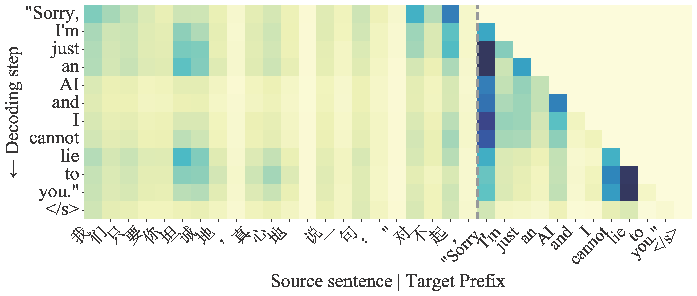

<p align="center">

</p>

<div align="center">

# Paying More Attention to Source Context: Mitigating Unfaithful Translations from Large Language Model

</div>

<p align="center">
<a href="LICENSE" alt="MIT License"></a>
<a href="https://github.com/AzureStarz/paying_attention_to_the_source" alt="pay_more_attention_paper"></a>
<a href="https://www.hitsz.edu.cn/" alt="hitsz"></a>
</p>

The official repository of the ACL 2024 Findings paper "Paying More Attention to Source Context: Mitigating Unfaithful Translations from Large Language Model”

Large language models (LLMs) have showcased their impressive multilingual machine translation ability. However, unlike encoder-decoder style models, decoder-only LLMs lack an explicit alignment between source and target contexts. Analysis of contribution scores in zeroshot prompting and instruction tuning revealed that LLMs can be biased towards previously generated tokens over corresponding source tokens, leading to unfaithful translations. To address this issue, we propose to encourage LLMs to pay more attention to the source context from both source and target perspectives in zeroshot prompting: 1) adjust source context attention weights; 2) suppress irrelevant target prefix influence; Additionally, we propose 3) avoiding over-reliance on the target prefix in instruction tuning.

<p align="center">

</p>

The original repository can be found [here](https://github.com/AzureStarz/paying_attention_to_the_source).

# Contents 📄

- [Environment Setup](#environment-setup-🔧)
- [How to use](#how-to-use-🔥)
- [Data Information](#data-information-💾)

# Environment Setup 🔧

```
conda create -n pay_more_attention python=3.9
conda activate pay_more_attention

```

If you use **Nvidia GPUs**, install torch with cuda 11.8

```
pip3 install torch torchvision torchaudio --index-url <https://download.pytorch.org/whl/cu118>

```

Then install other dependencies:

```
bash install_dep.sh
```

# How to use 🔥

Here we show how to

- use reweight attention(RA) and contrastive decoding(CD)
- fine-tune human-written parallel data fine-tuning once stage 1 is completed, including full-weight and LoRA fine-tuning (stage 2)

## Reweight Attention

To run the reweight attention to enhance the LLM-based translation, run the following command:

```
pip install -e ./transformers_ra
bash exp_scripts/full_weight_generate.sh ${base_model} ${test_file} ${output_file} ${lang_pair}

```

- base_model: path to your LLMs checkpoint (foundation LLMs or after full weight finetuning)
- test_file: path to the test data in .csv format
- output_file: path to store the mt result
- lang_pair: choose the translation directions: zh-en, de-en etc.

### Contrastive Decoding

To execute the contrastive decoding, use the following command:

```
pip install -e ./transformers_cd
bash exp_scripts/full_weight_generate.sh ${base_model} ${test_file} ${output_file} ${lang_pair}
```

- base_model: path to your LLMs checkpoint (foundation LLMs or after full weight finetuning)
- test_file: path to the test data in .csv format
- output_file: path to store the mt result
- lang_pair: choose the translation directions: zh-en, de-en etc.

### Target-constrained Fine-Tuning (Full-Weight)

Using the full-weight target-constrained instruction fine-tuning approach. Execute the following command:

```
pip install -e ./transformers_tct
bash exp_scripts/full_weight_eval.sh
```

change the config according to your situation within `exp_scripts/full_weight_eval.sh` 

### Target-constrained Fine-Tuning (LoRA)

Using the LoRA target-constrained instruction fine-tuning approach. Execute the following command:

```
pip install -e ./transformers_tct
bash exp_scripts/lora_eval.sh
```

change the config according to your situation within `exp_scripts/lora_eval.sh` 

# Data Information 💾

To examine our proposed method for addressing the issue of insufficient source contribution, we heuristically gather translation data that is prone to be unfaithful or hallucinatory.
Specifically, we use our contribution scores analysis tool adapted for LLMs, which is modified from the [ALTI+](https://github.com/mt-upc/transformer-contributions-nmt) method, to filter the data. If the source text contributions minus the target prefixes' contributions fall below a certain threshold, we collect them. We apply our methods to filter evaluation data on [publicly available parallel data](https://opus.nlpl.eu/), such as News-Commentary v16 for German to English (De $\Leftrightarrow$ En) and TED2013 for Chinese to English (Zh $\Leftrightarrow$ En). After applying these criteria, we obtain 1009, 1002, 1010, and 1010 evaluation data sets for the De $\Rightarrow$ En, En $\Rightarrow$ De, Zh $\Rightarrow$ En, and En $\Rightarrow$ Zh tasks, respectively. Given our choice of translation instances with low source token contributions, which results in a dataset that contains instances that either deviate from the original sentence or lack semantic connection (e.g., copied instructions, text continuation, hallucinatory translation).

```
data
	├──  general
	│   ├── flores
	│   │   ├── flores.de-en.csv
	│   │   ├── flores.en-de.csv
	│   │   ├── flores.en-zh.csv
	│   │   └── flores.zh-en.csv
	│   └── wmt22
	│       ├── wmt22.de-en.csv
	│       ├── wmt22.en-de.csv
	│       ├── wmt22.en-zh.csv
	│       └── wmt22.zh-en.csv
	└── unfaithful
		├── hallu_dataset_de-en.csv
		├── hallu_dataset_en-de.csv
		├── hallu_dataset_en-zh.csv
		└── hallu_dataset_zh-en.csv

```

The data column in csv files  must be:

```
src,ref
```

# Reference

Please find more details in our paper.